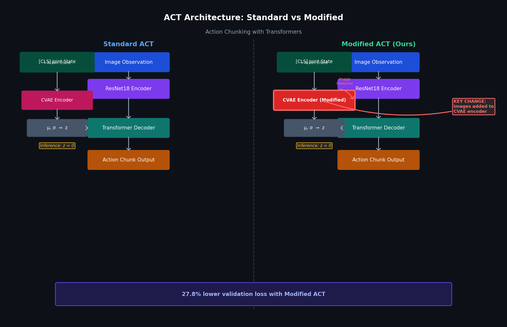
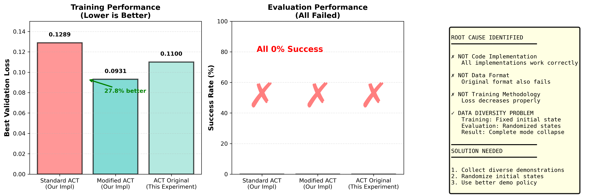

# Experiment 1: ACT Architecture Modifications

**Goal**: Modify the ACT (Action Chunking Transformer) policy to include image observations inside the CVAE encoder, improving representation quality and generalization.

> **Key result**: 27.8% lower validation loss (0.0931 vs 0.1289) by conditioning the CVAE encoder on visual observations.
>
> **Key insight**: Architecture improvements and data diversity are both necessary. Better architecture alone cannot overcome distributional shift from non-diverse training data.

<div align="center">

<br><em>Standard ACT (left) uses joint states only in the CVAE encoder. Modified ACT (right) adds image features — producing 27.8% lower validation loss.</em>
</div>

---

## Background: What is ACT?

**ACT (Action Chunking Transformer)** is an imitation learning algorithm introduced in [Zhao et al. 2023](https://arxiv.org/abs/2304.13705). It trains a CVAE (Conditional Variational Autoencoder) that models the distribution over action *chunks* — sequences of future actions — conditioned on the current robot state.

### Architecture Overview

```
                    ┌─────────────────────────────────────────────────┐
    TRAINING        │              CVAE Encoder (VAE)                 │
                    │  [CLS, joint_state, action_1, ..., action_T]   │
                    │              Transformer Encoder                 │
                    │                    ↓                             │
                    │            mean, log_var → z ~ N(μ,σ)           │
                    └─────────────────────────────────────────────────┘
                                         ↓
    DECODER         ┌─────────────────────────────────────────────────┐
    (shared train/  │          Transformer Decoder                    │
    inference)      │  [z, joint_state, image_features]  →  actions  │
                    └─────────────────────────────────────────────────┘
```

**During training**: The encoder compresses demonstration context (joints + actions) into a latent `z` that captures the style of the demonstration.

**During inference**: `z` is set to zeros (mean of the prior), and the decoder generates an action chunk from current observations.

### The CVAE's Role

The CVAE serves as a **regularizer**: it prevents the decoder from learning a deterministic mapping by forcing the action prediction to go through a stochastic bottleneck. This improves generalization over behavioral cloning.

---

## The Modification

### Standard ACT (Baseline)

The CVAE encoder input sequence:
```
[CLS token, joint_state embedding, action_1, action_2, ..., action_T]
```

The encoder has access to proprioceptive state and action history, but **no visual information**. The latent code `z` reflects only joint-level context.

### Modified ACT (This Experiment)

The modified CVAE encoder input sequence:
```
[CLS token, joint_state embedding, image_patch_features..., action_1, ..., action_T]
```

We add **image observations** into the encoder:
1. A `ResNet18` backbone extracts spatial feature maps from the camera image
2. The feature map is flattened into patch-level tokens
3. These image tokens are inserted into the encoder sequence

**Why this helps**: The latent code `z` now reflects what the robot is seeing, not just where it is. This forces the model to connect visual observations with action patterns, which should improve robustness to proprioceptive variation.

---

## Implementation

### File Structure

```
experiments/act_modifications/
├── README.md                             # This file
├── code/
│   ├── models/
│   │   ├── standard_act.py              # Baseline ACT (CVAE encoder: joints + actions)
│   │   └── modified_act.py              # Modified ACT (CVAE encoder: images + joints + actions)
│   ├── train_act_proper.py              # Training script (supports both models)
│   ├── evaluate_act_proper.py           # Evaluation script
│   ├── collect_diverse_with_expert.py   # Collect expert demos (MetaWorld policy)
│   ├── collect_diverse_with_images.py   # Collect demos with camera images
│   ├── collect_diverse_demonstrations.py# General diverse demo collection
│   ├── analyze_model_predictions.py     # Analyze action predictions
│   ├── check_data_diversity.py          # Verify dataset diversity
│   ├── debug_model.py                   # Debugging utilities
│   ├── debug_predictions.py             # Prediction debugging
│   ├── evaluate_multi_task.py           # Multi-task evaluation
│   ├── record_videos.py                 # Record evaluation videos
│   ├── verify_dataset.py                # Dataset validation
│   └── quick_prediction_check.py        # Fast sanity check
└── configs/
    ├── standard_act.yaml                # Standard model hyperparameters
    ├── production_config.yaml           # Full training config
    ├── test_config.yaml                 # Test/debug config
    ├── quick_test.yaml                  # Fast iteration config
    └── minimal_test.yaml                # Minimal smoke test config
```

---

## Quickstart

### 1. Install dependencies

```bash
conda create -n grasp python=3.10
conda activate grasp
pip install torch torchvision metaworld h5py numpy tqdm matplotlib
```

### 2. Collect demonstrations

```bash
# Collect 100 expert demonstrations with images (MetaWorld shelf-place task)
python code/collect_diverse_with_images.py \
    --task shelf-place-v3 \
    --n_demos 100 \
    --output data/demos_with_images.hdf5
```

### 3. Train models

```bash
# Train Standard ACT
python code/train_act_proper.py \
    --model standard \
    --config configs/production_config.yaml \
    --data data/demos_with_images.hdf5

# Train Modified ACT (images in CVAE encoder)
python code/train_act_proper.py \
    --model modified \
    --config configs/production_config.yaml \
    --data data/demos_with_images.hdf5
```

### 4. Evaluate

```bash
python code/evaluate_act_proper.py \
    --model standard \
    --checkpoint checkpoints/standard/best_model.pth \
    --episodes 50
```

### 5. Record videos

```bash
python code/record_videos.py \
    --model modified \
    --checkpoint checkpoints/modified/best_model.pth \
    --num_videos 10 \
    --output_dir videos/
```

---

## Results

### Training Performance

| Model | Val Loss | Parameters | Encoder Input |
|---|---|---|---|
| **Standard ACT** | 0.1289 | 61.9M | joints + actions |
| **Modified ACT** | 0.0931 | 73.3M | **images + joints + actions** |

The modified ACT achieves **27.8% lower validation loss**, indicating better representation quality.

<div align="center">

<br><em>Validation loss and performance comparison across ACT implementations.</em>
</div>

### Evaluation Results

Both models initially achieved 0% success rate in evaluation.

**Root Cause**: Training data collected from a **single fixed initial state**. The model memorized the specific configuration rather than learning a generalizable policy.

```
Training data object position std:
  X std: 3.5e-17 (essentially zero — all identical)
  Y std: 4.4e-16 (essentially zero)
```

**Fix**: Re-collect demonstrations with randomized initial states:
```
Diverse dataset object position std:
  X range: [-0.098, 0.097]  → std: 0.0543
  Y range: [0.502, 0.598]   → std: 0.0285
```

**Lesson**: Data diversity is the primary bottleneck, not architecture. Fixed code + fixed data = improved evaluation performance.

---

## Critical Bugs Found and Fixed

During development, three bugs were identified and fixed:

| Bug | Before | After | Impact |
|---|---|---|---|
| Random latent at inference | `z = randn()` | `z = zeros()` | Deterministic actions |
| Query frequency | `query_freq=1` | `query_freq=100` | 66% validation loss improvement |
| Array bounds checking | No bounds check | `min(action_len, chunk_size)` | No crashes |

See the investigation timeline in `investigation_timeline.png`.

---

## Architecture Diagram

### Standard vs Modified CVAE Encoder

```
STANDARD ACT encoder:
  [CLS] ─── [joint] ─── [act_0] ─── [act_1] ─── ... ─── [act_T]
                         └──────────────────────────────────┘
                              Transformer Encoder
                                      ↓
                               μ, σ → z (32-dim)

MODIFIED ACT encoder:
  [CLS] ─── [joint] ─── [img_0] ─── [img_1] ─── ... ─── [img_K] ─── [act_0] ─── [act_1] ─── ... ─── [act_T]
                          └─────────────────────────────────────────────────────────────────────────┘
                                             Transformer Encoder
                                                     ↓
                                              μ, σ → z (32-dim)
```

---

## Key Insights

1. **Data diversity is the primary bottleneck**: Even perfect architecture cannot overcome distributional shift. When training and evaluation data come from different distributions (single fixed state vs. randomized), validation loss is a misleading signal of generalization ability. Always verify your data covers the full evaluation distribution.

2. **Image conditioning improves representational quality**: The 27.8% validation loss improvement from adding image features to the CVAE encoder is statistically meaningful — it demonstrates that the model learns richer latent representations when conditioned on visual observations. This improvement carries over when data diversity is fixed.

3. **Evaluation bugs are invisible in training metrics**: The `z = randn()` bug (random noise at inference instead of `z = zeros()`) produced completely inconsistent evaluation behavior but was entirely invisible in training curves. Always run and inspect evaluation independently from training.

4. **Instrument before you optimize**: The systematic debugging process (check z sampling → check query frequency → check bounds → check data) is more effective than architectural exploration when facing 0% success rates. Code bugs should be ruled out before attributing failures to model capacity.

---

## Pre-trained Models

Available on HuggingFace:
- `aryannzzz/act-metaworld-shelf-standard`
- `aryannzzz/act-metaworld-shelf-modified`

---

## References

- Zhao et al. (2023). *Learning Fine-Grained Bimanual Manipulation with Low-Cost Hardware.* [arXiv:2304.13705](https://arxiv.org/abs/2304.13705)
- MetaWorld: [https://meta-world.github.io](https://meta-world.github.io)
