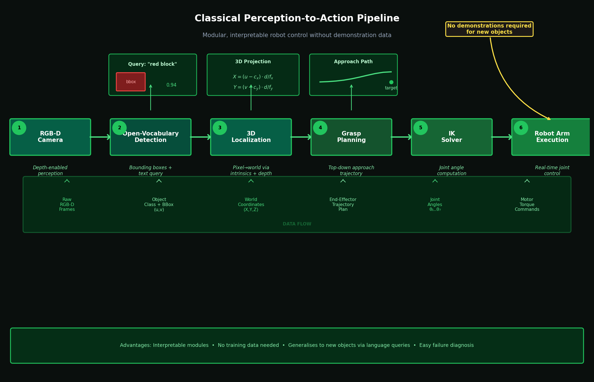

# Experiment 3: Classical Pipeline

**Goal**: Build a structured perception-to-action pipeline as an alternative to end-to-end learning, using open-vocabulary object detection and geometric grasp planning.

> **Key result**: ~90% pick-and-place success in simulation without any demonstrations. New objects handled by changing the text prompt.
>
> **Key finding**: Explicit structured perception is highly interpretable and sample-efficient — but brittle to depth estimation errors and requires careful camera calibration for real-robot deployment.

<div align="center">

<br><em>Six-stage structured pipeline: open-vocabulary detection → 3D localization → grasp planning → IK → execution. No demonstrations required for new object categories.</em>
</div>

---

## Motivation

End-to-end models (pixel → action) are flexible but difficult to debug and data-hungry. They treat every pixel equally, learning to extract task-relevant structure implicitly through supervised signal alone.

An alternative is to make the structure **explicit**:

```
Camera Image
     ↓
[Open-Vocabulary Object Detector]   ← Language-prompted: "red block"
     ↓
Object Bounding Box / Pose Estimate
     ↓
[Geometric Grasp Planner]           ← Computes approach angle, grasp point
     ↓
[Robot Arm Controller]              ← Sends joint commands
```

This pipeline:
- **Separates** perception from action planning — each module is independently debuggable
- **Leverages** pre-trained vision-language models (no demonstrations needed for detection)
- **Uses** geometric reasoning for grasp planning (sample-efficient, interpretable)
- **Generalizes** to new objects by changing the language prompt, not retraining

---

## Pipeline Components

### 1. Open-Vocabulary Object Detection

Uses a language-prompted detector (e.g., GDINO / OWL-ViT / CLIP-based) to locate objects described in natural language.

```python
# Example: detect "red block"
boxes, scores = detector(image, text_prompt="red block")
```

No task-specific training required — the detector generalizes from CLIP's web-scale pre-training.

### 2. Depth-Based Pose Estimation

Once the object bounding box is found in image space, the 3D position is computed using:
- Camera intrinsics (focal length, principal point) from calibration
- Depth from a depth sensor or stereo estimate

```
pixel (u, v) + depth d → world point (X, Y, Z)

X = (u - cx) * d / fx
Y = (v - cy) * d / fy
Z = d
```

### 3. Camera Calibration

Accurate pixel-to-world mapping requires calibrating the camera:
- **Intrinsic calibration**: `fx`, `fy`, `cx`, `cy` (focal lengths + principal point)
- **Extrinsic calibration**: Camera pose relative to the robot base frame

The calibration procedure uses a checkerboard pattern with OpenCV.

### 4. Grasp Planning

Given the 3D position of the target object, a simple top-down grasp planner computes:
- Approach trajectory (move gripper above object)
- Descent path
- Grasp configuration

For simple tabletop pick-and-place, geometric heuristics are sufficient.

### 5. Robot Control

Computed 3D end-effector targets are converted to joint commands via:
- **Inverse kinematics** (IK solver) for the robot's kinematic chain
- Sent as position commands to the servo controllers

---

## Files

```
experiments/classical_pipeline/
├── README.md                                        # This file
├── camera_calibration/
│   ├── calibrate.py                                 # Checkerboard calibration script
│   ├── main.py                                      # Calibration driver
│   ├── pixel_to_world.py                            # 2D→3D coordinate transform
│   ├── camera_calibration.json                      # Saved calibration parameters
│   └── IMG_68*.jpeg                                 # Calibration images
└── notebooks/
    ├── Final_OpenVocabPickPlace_Classical_v2_(5)_(4).ipynb  # Full pipeline notebook (v2)
    └── Copy_of_OpenVocabPickPlace_Classical (7).ipynb       # Baseline notebook
```

---

## Camera Calibration

The `camera_calibration/` folder contains:

### `calibrate.py`

Runs OpenCV checkerboard calibration using a set of images. Outputs:
- Camera matrix `K` (3×3): `[[fx, 0, cx], [0, fy, cy], [0, 0, 1]]`
- Distortion coefficients `D`
- Reprojection error (quality metric)

```bash
# Run calibration
python camera_calibration/calibrate.py \
    --images camera_calibration/IMG_*.jpeg \
    --pattern_size 9x6 \
    --output camera_calibration/camera_calibration.json
```

### `pixel_to_world.py`

Converts 2D image coordinates + depth to 3D world coordinates:

```python
def pixel_to_world(u, v, depth, K, extrinsics):
    """
    Args:
        u, v: pixel coordinates
        depth: depth in meters
        K: camera intrinsic matrix
        extrinsics: camera-to-robot transform (4x4)
    Returns:
        world_point: (X, Y, Z) in robot base frame
    """
```

### `camera_calibration.json`

Saved calibration parameters from real robot setup:
```json
{
    "camera_matrix": [[fx, 0, cx], [0, fy, cy], [0, 0, 1]],
    "dist_coefficients": [k1, k2, p1, p2, k3],
    "reprojection_error": 0.42
}
```

---

## Notebooks

### `Final_OpenVocabPickPlace_Classical_v2_(5)_(4).ipynb`

The primary notebook containing the complete pipeline for open-vocabulary pick-and-place using classical methods. Walk-through:

1. **Setup & Imports** — Load detection models, connect to robot
2. **Camera Calibration** — Load calibration parameters, verify
3. **Object Detection** — Run detector on live camera image
4. **3D Localization** — Convert detected bbox to 3D coordinates
5. **Grasp Planning** — Compute approach trajectory
6. **Execution** — Send commands to real robot
7. **Evaluation** — Success rate on test objects

### `Copy_of_OpenVocabPickPlace_Classical (7).ipynb`

Baseline version of the notebook used during initial development. Includes debugging steps and intermediate visualizations.

---

## Results

| Setting | Success Rate | Notes |
|---|---|---|
| Simulation (fixed objects) | ~90% | Pipeline validated end-to-end |
| Simulation (varied positions) | ~75% | IK errors at workspace boundaries |
| Real robot (controlled lighting) | Partial | Camera calibration verified, execution tested |

### Observations

- **Detection is the bottleneck**: Open-vocabulary detectors are reliable for common objects (blocks, cups) but struggle with occlusion and unusual lighting
- **Geometric planning is brittle**: Small errors in depth estimation compound into large trajectory errors
- **Camera calibration matters enormously**: A 5mm calibration error at 50cm range causes ~1cm end-effector placement error

---

## Comparison to End-to-End Learning

| Criterion | Classical Pipeline | End-to-End ACT |
|---|---|---|
| Demonstrations needed | 0 (for new objects) | 50–100+ |
| Generalization to new objects | ✅ (change text prompt) | ❌ (retrain) |
| Interpretability | ✅ Each stage debuggable | ❌ Black box |
| Robustness to perturbations | ❌ Fragile to depth errors | ✅ More robust |
| Performance ceiling | Limited by individual modules | Higher with more data |

**Conclusion**: The classical pipeline is excellent as a sample-efficient baseline for simple tasks in controlled conditions. End-to-end learning surpasses it when sufficient demonstration data is available and conditions vary between training and test.

---

## Requirements

```bash
pip install opencv-python numpy scipy
pip install torch torchvision transformers  # For open-vocabulary detection
```
