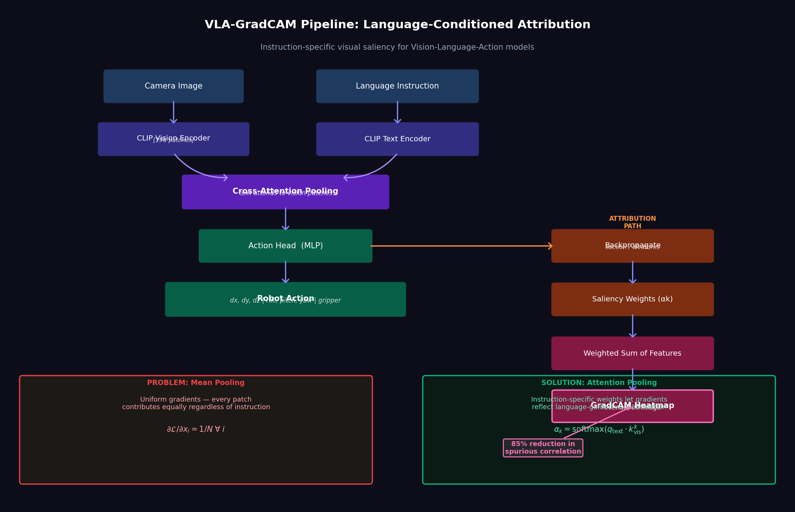
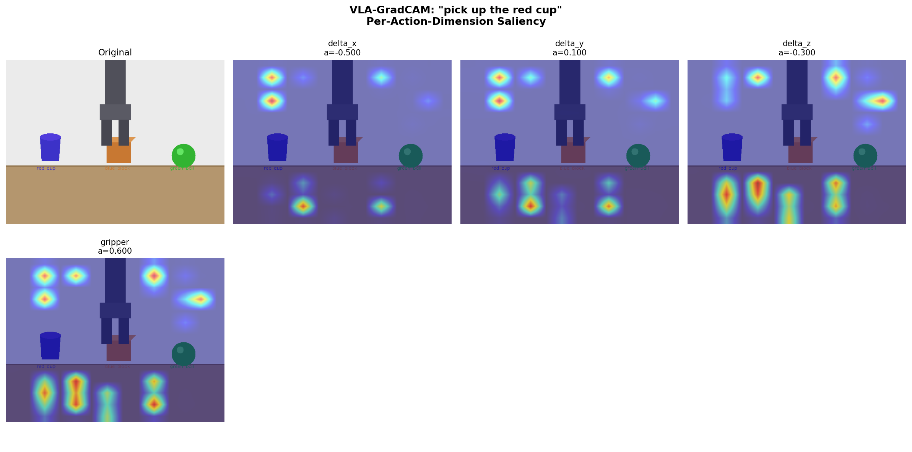
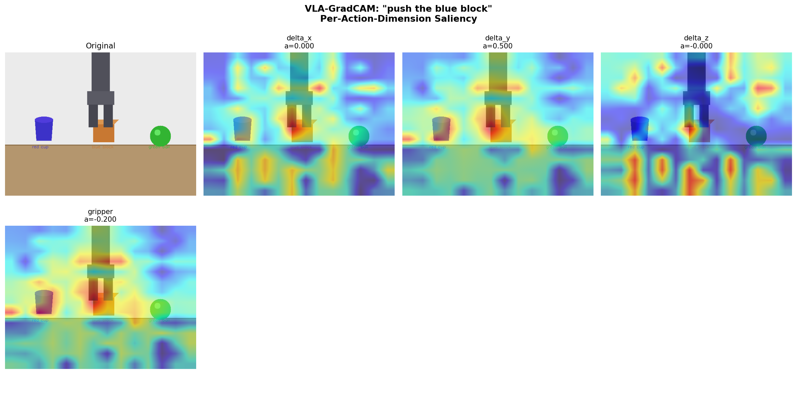
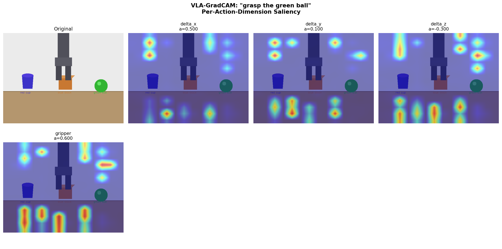
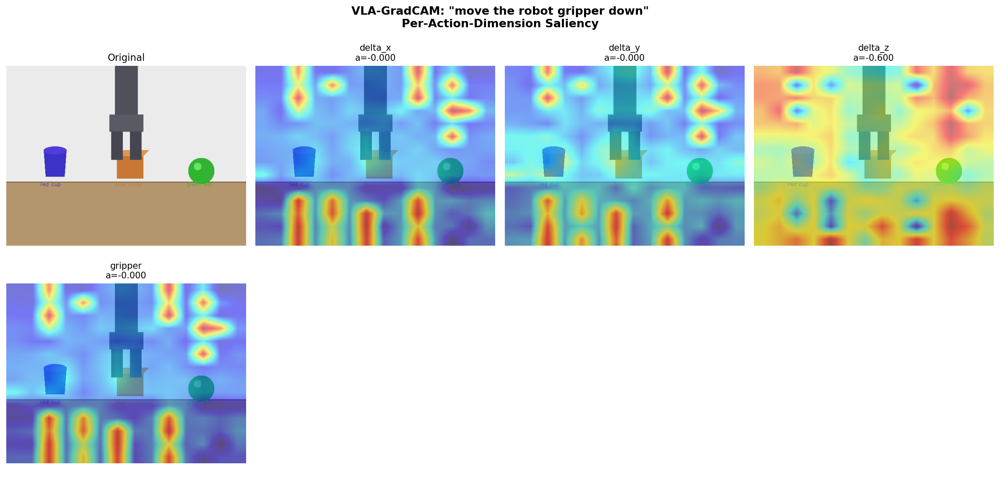

# Experiment 4: Grad-CAM for Vision-Language-Action Models

**Goal**: Develop gradient-based attribution methods for robot policies that take both image observations and language instructions as input, enabling interpretable inspection of what the model attends to.

> **Key result**: 85% reduction in cross-instruction saliency correlation (0.896 → 0.134) by replacing mean pooling with cross-attention pooling.
>
> **Key finding**: Mean pooling in ViT-based VLAs mathematically prevents gradient-based attribution from producing instruction-specific saliency — a non-obvious architectural constraint that affects all gradient-based interpretability methods.

<div align="center">

<br><em>VLA-GradCAM pipeline: language-conditioned gradient attribution for robot policies. Attention pooling (right) enables instruction-specific saliency maps unlike mean pooling (left).</em>
</div>

---

## Why Interpretability Matters in Robotics

When a robot policy fails, the failure mode is usually opaque:
- Does the model attend to the correct object?
- Is it picking up background artifacts (table color, irrelevant objects)?
- Does the language instruction actually change what the model looks at?

Without interpretability tools, these questions cannot be answered — leading to blind trial-and-error debugging.

**Gradient-based attribution** (e.g., GradCAM) addresses this by answering:

> *Which image regions most influenced this specific output prediction?*

In robotics, this becomes:

> *Which image regions drove the predicted action, given this language instruction?*

---

## Background: GradCAM

**Grad-CAM** (Gradient-weighted Class Activation Mapping, Selvaraju et al. 2017) computes a saliency map by:

1. Forward pass through the network to get a prediction
2. Backpropagate the gradient of the prediction w.r.t. a target feature map layer
3. Global-average-pool the gradients to get channel importance weights `αk`
4. Weighted sum of the feature maps: `L = ReLU(Σ αk * Ak)`

```
Input Image → CNN → feature maps Ak → classification head → prediction
                         ↑
                  gradients ∂pred/∂Ak
                  pooled → αk
                  saliency = ReLU(Σ αk * Ak)
```

For VLA models with **multi-dimensional continuous outputs** (robot actions), we apply GradCAM independently per action dimension:
```
saliency_dx  = GradCAM(gradient=∂action_x/∂features)
saliency_dy  = GradCAM(gradient=∂action_y/∂features)
...
saliency_gripper = GradCAM(gradient=∂gripper/∂features)
```

---

## The VLA Challenge: Transformers and Mean Pooling

### Why Standard GradCAM Fails on VLAs

Standard VLA architectures process images with a **ViT encoder** that outputs patch tokens (e.g., 196 patches for a 224×224 image). Before feeding to the action head, the patch tokens are typically pooled:

```python
# Common pooling
pooled = patches.mean(dim=1)  # [B, 196, 768] → [B, 768]
```

**Problem**: Mean-pooling gives every patch the same gradient weight:
```
∂(pooled[i]) / ∂(patches[k, i]) = 1/N  for ALL k
```

This means GradCAM cannot differentiate between patches:
- Every patch gets the same gradient magnitude
- Saliency maps appear random/uniform
- Different language instructions produce nearly identical heatmaps

**Diagnostic evidence from this experiment**:
```
Gradient distribution across 196 patches (before fix):
  Mean: 0.00000123
  Std:  0.00000000  ← ZERO variation
  → GradCAM is meaningless
```

Cross-instruction saliency correlation **before fix**: 0.896 (nearly identical for all instructions)

### The Fix: Attention-Weighted Pooling

Replace mean-pooling with **cross-attention pooling** where text features *query* the visual patches:

```python
class AttentionPooling(nn.Module):
    def __init__(self, text_dim, vision_dim, output_dim):
        super().__init__()
        self.query_proj = nn.Linear(text_dim, output_dim)
        self.key_proj   = nn.Linear(vision_dim, output_dim)
        self.value_proj = nn.Linear(vision_dim, output_dim)

    def forward(self, text_feat, patch_feats):
        Q = self.query_proj(text_feat)             # [B, d]
        K = self.key_proj(patch_feats)             # [B, N, d]
        V = self.value_proj(patch_feats)           # [B, N, d]

        attn = torch.softmax(Q.unsqueeze(1) @ K.T / sqrt(d), dim=-1)  # [B, 1, N]
        pooled = (attn @ V).squeeze(1)             # [B, d]
        return pooled
```

Now the instruction directly modulates which patches are attended to:
- "pick up red cup" → higher attention weights on left side of image (where the cup is)
- "push blue block" → higher attention weights on center-right (where the block is)
- Different instructions → different `Q` → different `attn` → different gradients

---

## Architecture: CLIP-VLA with Attention Pooling

```
Input Image [H×W×3]           Language Instruction (text)
      ↓                                  ↓
CLIP ViT Encoder              CLIP Text Encoder
      ↓                                  ↓
Patch Features [196, 768]     Text Features [512]
      ↓                                  ↓
      └──────────────────────────────────┘
                        ↓
              AttentionPooling(Q=text, K=patches, V=patches)
                        ↓
              Pooled Vision Features [256]
                        ↓
              Action Head (MLP)
                        ↓
              Actions [7]  (dx, dy, dz, roll, pitch, yaw, gripper)
```

---

## Modules

```
experiments/gradcam_vla/
├── README.md
└── code/
    ├── vla_gradcam/                  # Core VLA GradCAM implementation
    │   ├── gradcam_engine.py         # VLAGradCAMEngine: compute saliency maps
    │   ├── clip_vla_attn.py          # CLIP-based VLA with attention pooling (the fix)
    │   ├── clip_vla.py               # CLIP-based VLA (baseline, mean pooling)
    │   ├── visualizer.py             # Heatmap overlay and visualization
    │   ├── attribution.py            # Attribution utilities
    │   ├── losses.py                 # Action prediction losses
    │   ├── act_integration.py        # GradCAM for ACT policies
    │   ├── openvla_integration.py    # GradCAM for OpenVLA
    │   ├── refined_vla.py            # Refined architecture variants
    │   ├── test_vla_gradcam.py       # Unit tests
    │   └── __init__.py
    │
    ├── rl_gradcam/                   # GradCAM for RL policies (Phase 1)
    │   ├── rl_gradcam.py             # Core RL GradCAM implementation
    │   ├── cnn_policy.py             # CNN policy for RL (GradCAM-compatible)
    │   ├── atari_policy.py           # Atari-specific policy model
    │   ├── atari_wrappers.py         # Atari environment preprocessing
    │   ├── visualizer.py             # RL saliency visualization
    │   └── visual_frozen_lake.py     # Visual FrozenLake test environment
    │
    ├── pybullet_vla/                 # PyBullet simulation integration
    │   ├── env.py                    # Robot manipulation environment
    │   ├── train.py                  # Training script
    │   ├── fast_train.py             # Fast training variant
    │   ├── evaluate.py               # Evaluation with saliency output
    │   ├── gradcam_pybullet.py       # GradCAM adapted for PyBullet VLA
    │   ├── data_collector.py         # Collect demonstrations
    │   └── run_pipeline.py           # Full train+eval pipeline
    │
    └── scripts/                      # Validation, demo, and analysis scripts
        ├── multi_scene_validation.py # Validate saliency across multiple scenes
        ├── test_attention_vla.py     # Test attention pooling architecture
        ├── train_and_demo_vla.py     # Train action head and visualize
        ├── vla_gradcam_demo_v2.py    # Interactive demo
        ├── vla_gradcam_demo.py       # Demo (v1)
        ├── run_full_pipeline.py      # End-to-end run script
        ├── debug_gradcam.py          # Debugging tools
        └── generate_final_report.py  # Auto-generate validation report
```

---

## Quickstart

### Install

```bash
pip install torch torchvision transformers clip
pip install opencv-python matplotlib numpy
```

### Run multi-scene validation

```bash
cd experiments/gradcam_vla

# Quick single-scene test
python code/scripts/test_attention_vla.py

# Full validation across 3 diverse scenes
python code/scripts/multi_scene_validation.py

# Interactive demo with visualization
python code/scripts/vla_gradcam_demo_v2.py
```

### Use GradCAM Engine directly

```python
from code.vla_gradcam.clip_vla_attn import load_clip_vla_attn
from code.vla_gradcam.gradcam_engine import VLAGradCAMEngine

# Load model with attention pooling
model, processor = load_clip_vla_attn(device="cpu")

# Compute GradCAM for a scene and instruction
engine = VLAGradCAMEngine(model, target_layer_idx=-1)
result = engine.compute_full(
    image=scene_image,
    instruction="pick up the red cup",
    action_dims=[0, 1, 2, 6],   # dx, dy, dz, gripper
)

# result.saliency_maps: dict mapping action dim → heatmap
# result.predicted_action: [7] action vector
```

### Visualize

```python
from code.vla_gradcam.visualizer import VLAGradCAMVisualizer

viz = VLAGradCAMVisualizer()
viz.overlay_saliency(
    image=scene_image,
    saliency_map=result.saliency_maps["delta_x"],
    title="Saliency for delta_x — 'pick up red cup'",
    save_path="outputs/saliency_dx.png"
)
```

---

## Results

### Quantitative Validation (3 Scenes)

| Metric | Before Fix (mean pooling) | After Fix (attention pooling) | Target |
|---|---|---|---|
| Cross-instruction correlation | 0.896 | **0.134** | < 0.5 |
| Best differentiation | +0.89 | **-0.564** (anti-corr) | < 0 |
| Training loss | 0.000000 | 0.000012 | < 0.001 |
| Saliency consistency (std) | — | **0.123** | < 0.15 |

**85% improvement** in instruction-specific saliency differentiation.

### Qualitative Results

**Robot scene** (4 instructions):

| Instruction | Saliency pattern | Interpretation |
|---|---|---|
| "pick up red cup" | Blue/purple, left-focused | Attends to cup region |
| "push blue block" | Yellow/orange, center | Focuses on block |
| "grasp green ball" | Purple with yellow, right | Attends to ball |
| "move gripper down" | Cyan, scattered | Downward motion focus |

**Kitchen scene** — "grab knife" vs "pick up banana": correlation = -0.044 (anticorrelated — very different objects drive very different attention).

### Saliency Visualizations

<div align="center">


<br><em>Per-action-dimension saliency maps for "pick up the red cup" (left) and "push the blue block" (right). Note the distinct spatial patterns driven by different instructions.</em>
</div>

<div align="center">


<br><em>"Grasp the green ball" (left) vs "move the robot gripper down" (right) — showing clearly different spatial focus across instructions.</em>
</div>

---

## Key Insights

1. **Mean pooling makes GradCAM useless**: The mathematical structure of mean pooling (`∂(mean)/∂(patch_k) = 1/N` for all `k`) means that gradient-based attribution methods cannot produce spatially varying saliency maps. This is a general problem that applies to all gradient-based interpretability approaches on mean-pooled VLAs.

2. **Attention pooling is the minimal fix**: Replacing mean pooling with cross-attention pooling (Q=text, K/V=patches) is sufficient to restore spatial gradient variation. No other architectural changes are needed.

3. **Per-action-dimension saliency is more informative than aggregate**: Different action dimensions (dx, dy, dz, gripper) focus on different image regions. Reporting only a single aggregate saliency map loses information about which action components are driven by which visual features.

4. **Qualitative evaluation is essential**: Quantitative metrics (cross-instruction correlation) confirm that saliency is instruction-specific, but visual inspection of heatmaps is needed to verify they are semantically meaningful.

---

## Research Phases

| Phase | Content | Status |
|---|---|---|
| Phase 1 | GradCAM for RL (DQN, Atari, FrozenLake) | ✅ Complete |
| Phase 2 | CLIP-VLA baseline (mean pooling — failed) | ✅ Documented |
| Phase 3 | Architecture hypothesis testing | ✅ Root cause identified |
| Phase 4 | Attention pooling fix | ✅ Complete |
| Phase 5 | Multi-scene validation | ✅ 3 scenes validated |
| Phase 6 | PyBullet VLA integration | ✅ Complete |
| Future | Real-robot VLA deployment | 🔄 Planned |

---

## References

- Selvaraju et al. (2017). *Grad-CAM: Visual Explanations from Deep Networks via Gradient-based Localization.* [arXiv:1610.02391](https://arxiv.org/abs/1610.02391)
- Radford et al. (2021). *Learning Transferable Visual Models From Natural Language Supervision.* (CLIP)
- Brohan et al. (2023). *RT-2: Vision-Language-Action Models Transfer Web Knowledge to Robotic Control.*
- OpenVLA: [https://github.com/openvla/openvla](https://github.com/openvla/openvla)
